# frameergo

An ergonomic laptop based off of the framework 13, based off of the concept by the Evan and Katelyn youtube channel. It will feature a keyboard based on the ferris sweep (though modified), and an adjustable display.

---

## how use??!1/?

Put it together and enjoy... its pretty self explanitory. You can pivot the screen however you wish, as long as the cables reach.

---

## but... why?

Why not? lol. More realistically, I wanted to do a project that challenged my current skillset and allow me to grow from it. Mainly with KiCAD and CAD in general.

---

## Frameortho KiCAD (The keyboard)

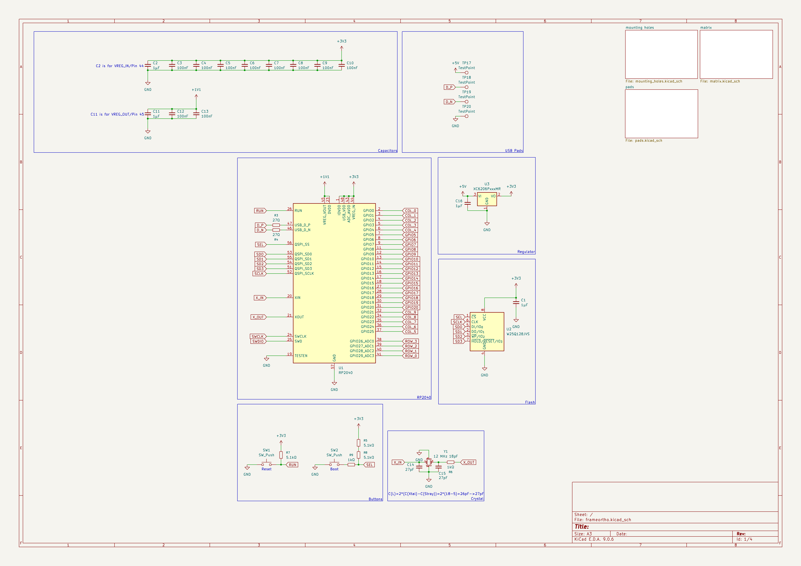
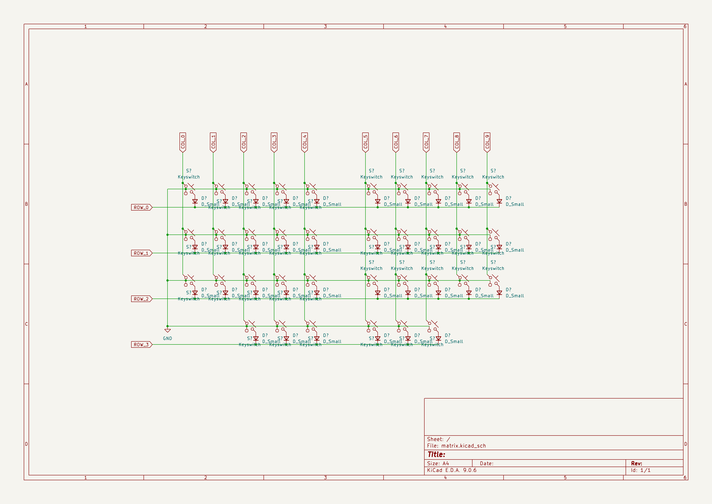
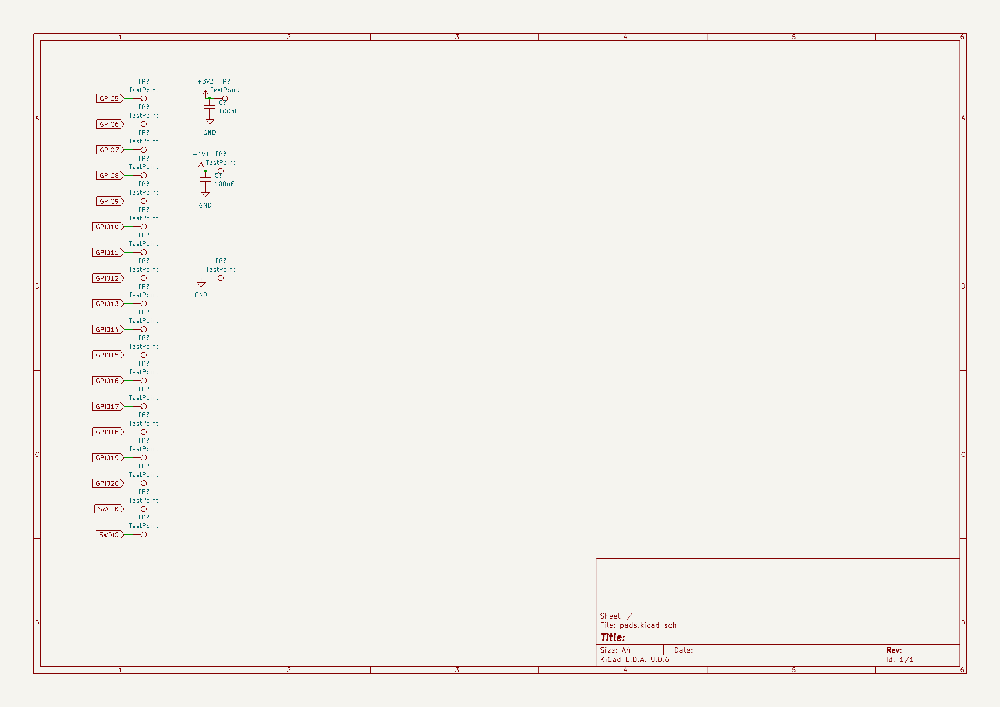
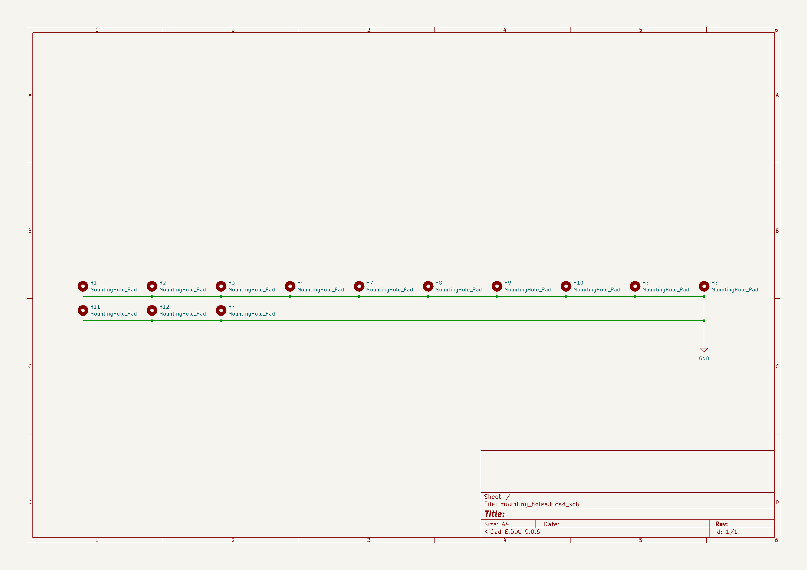
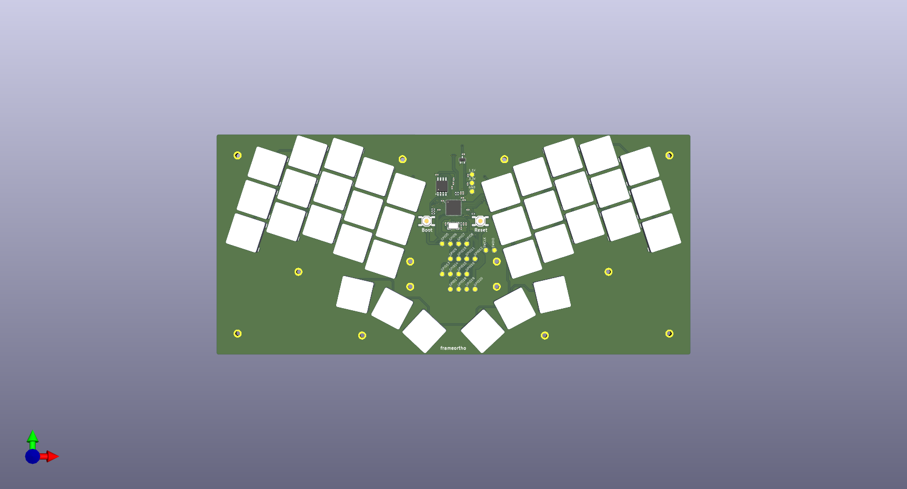
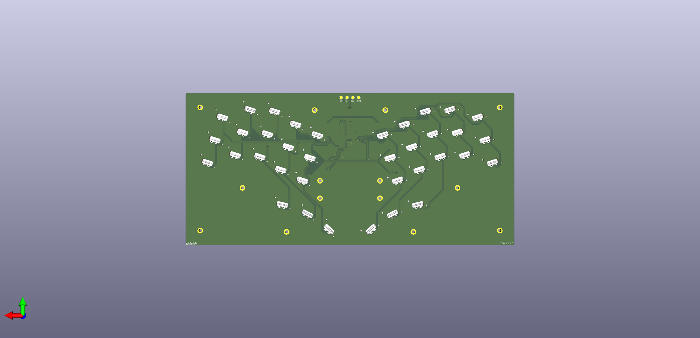

---

## Display Adapters

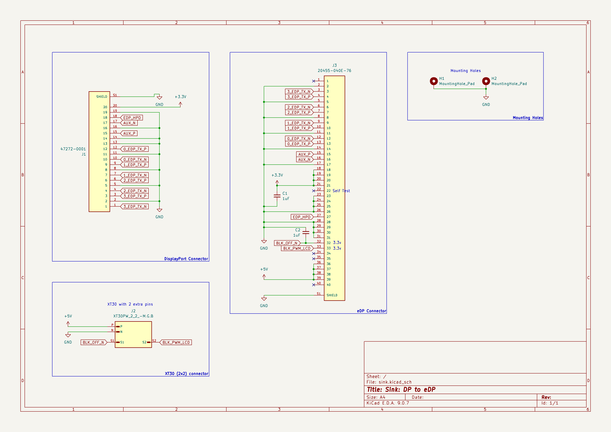
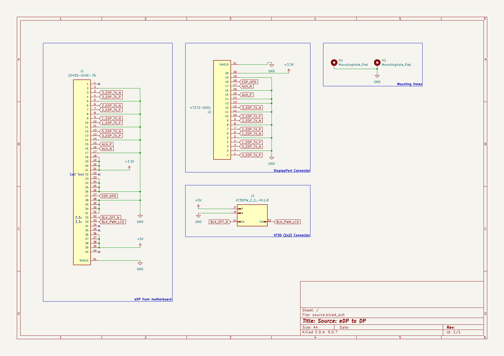
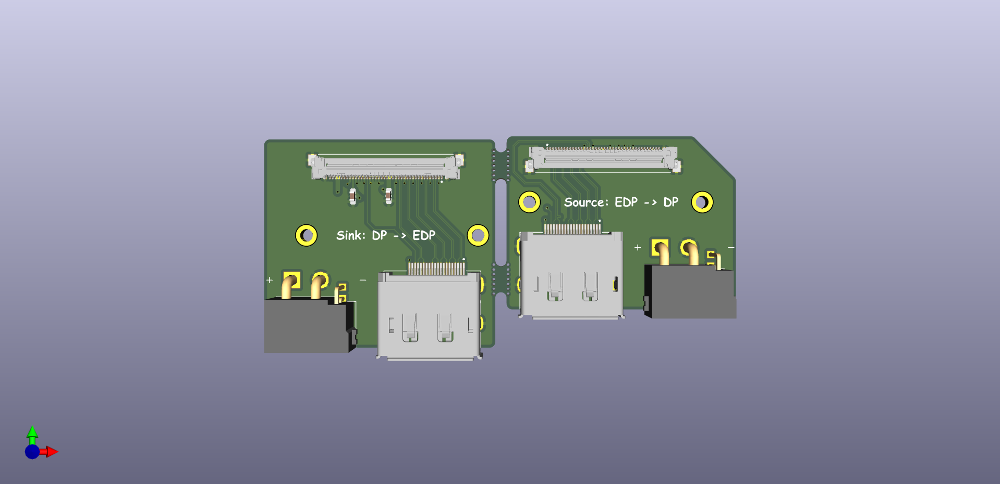
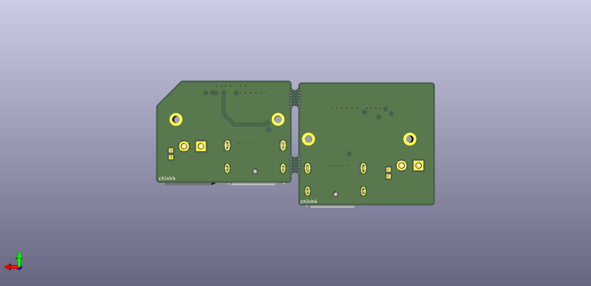

---

## USB Hub

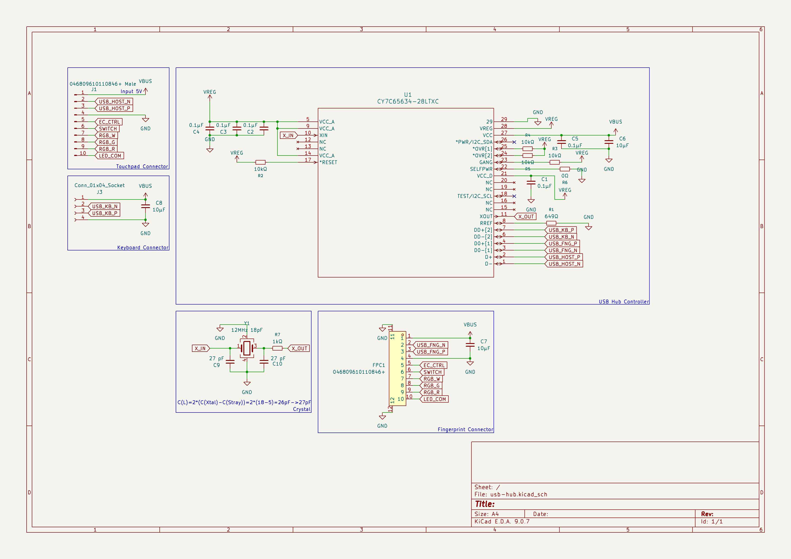
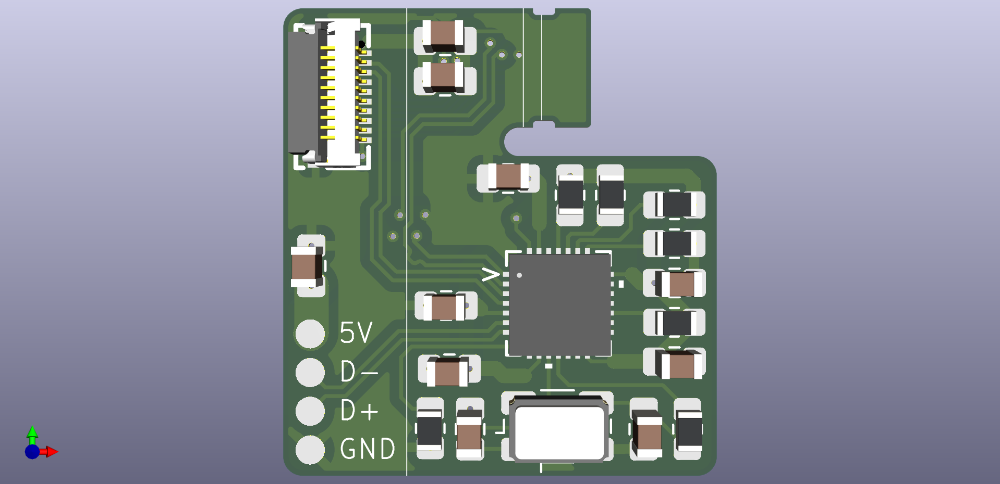
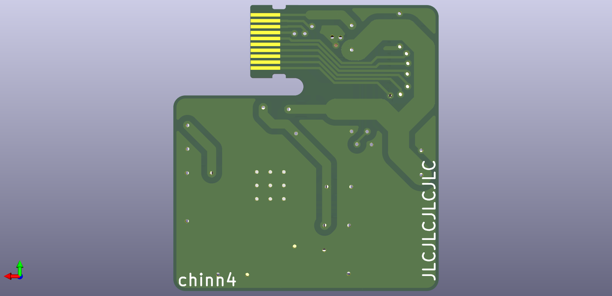

---

## BOM
| Item                          | Quantity             | Price (USD)   | Link                                                                                        | Description                       |
|:------------------------------|:---------------------|:--------------|:--------------------------------------------------------------------------------------------|:----------------------------------|
| PCB + Stencil (Sink + Source) | 5                    | $14.11        | https://jlcpcb.com/                                                                         | PCB for adapters                  |
| Display Port Cable            | 1                    | $7.50         | https://www.amazon.com/dp/B01J8S6X2I                                                        | Display Port cable                |
| 20455-040E-76                 | 2                    | $4.42         | https://www.digikey.com/en/products/detail/i-pex/20455-040E-76/22108829                     | EDP connector                     |
| XT30 (2+2) Right Male         | 2                    | $4.08         | https://www.aliexpress.us/item/3256804674449127.html                                        | Connector for power wires         |
| XT30 (2+2) Right Female       | 2                    | $4.44         | https://www.aliexpress.us/item/3256804674449127.html                                        | Connector for power               |
| Molex 0472720001              | 2                    | $11.06        | https://www.digikey.com/en/products/detail/molex/0472720001/1765727                         | Display Port connector            |
| Framework EDP Cable           | 1                    | $9.00         | https://frame.work/products/edp-cable                                                       | EDP cable for display             |
| Flex PCB + Stencil            | 5                    | $5.05         | https://jlcpcb.com/                                                                         | USB Hub Flex Cable                |
| CY7C65634-28LTXC              | 5                    | $12.25        | https://www.digikey.com/en/products/detail/infineon-technologies/CY7C65634-28LTXC/2805204   | USB Hub IC                        |
| RR1220P-102-D                 | 10                   | $0.31         | https://www.digikey.com/en/products/detail/susumu/RR1220P-102-D/432291                      | 1k ohm resistor                   |
| CRCW080510K0FKEA              | 10                   | $0.41         | https://www.digikey.com/en/products/detail/vishay-dale/CRCW080510K0FKEA/1175751             | 10k ohm resistor                  |
| C0805C104K5RACTU              | 10                   | $0.16         | https://www.digikey.com/en/products/detail/kemet/C0805C104K5RACTU/411169                    | CAP CER 0.1UF 50V X7R 0805        |
| RMCF0805ZT0R00                | 10                   | $0.06         | https://www.digikey.com/en/products/detail/stackpole-electronics-inc/RMCF0805ZT0R00/1756901 | RES 0 OHM JUMPER 1/8W 0805        |
| ABM3B-12.000MHZ-B2-T          | 5                    | $3.35         | https://www.digikey.com/en/products/detail/abracon-llc/ABM3B-12-000MHZ-B2-T/675311          | CRYSTAL 12.0000MHZ 18PF SMD       |
| CC0805JRNPO9BN270             | 10                   | $0.48         | https://www.digikey.com/en/products/detail/yageo/CC0805JRNPO9BN270/302838                   | CAP CER 27PF 50V C0G/NPO 0805     |
| LMK212BJ106KG-T               | 10                   | $0.16         | https://www.digikey.com/en/products/detail/taiyo-yuden/LMK212BJ106KG-T/930652               | CAP CER 10UF 10V X5R 0805         |
| PCB + PCBA                    | 2 (PCBA) + 3 (Blank) | $45.30        | https://jlcpcb.com/                                                                         | Keyboard PCB                      |
| PG1316S                       | 40                   | $30.00        | https://modulo.industries/product/pg1316s-switch/                                           | Keyswitches                       |
| SOD-123 Diode                 | 40                   | $30.00        | https://typeractive.xyz/products/smd-diodes                                                 | Diodes                            |
| TL3342                        | 2                    | $1.16         | https://www.digikey.com/en/products/base-product/e-switch/141/TL3342/472571                 | Buttons for boot and reset        |
| PG1316 Keycaps                | 4                    | $18.00        | https://holykeebs.com/products/kailh-pg1316s-keycaps?variant=49205120270626                 | Keycaps for keyswitches           |
| PETG Filament                 | 2                    | $24.99        | https://www.amazon.com/SUNLU-Filament-Strength-Dimensional-Accuracy/dp/B0FRRX8YDF           | Filament for case                 |
| Framework 13 Motherboard      | 1                    | Varies        | https://frame.work/marketplace/mainboards                                                   | Motherboard                       |
| Invisible Selfie Stick        | 4                    | $21.62        | https://www.aliexpress.us/item/3256805833609538.html                                        | For hinges and screen support     |
| Threaded bumper               | 2                    | $9.40         | https://www.mcmaster.com/9546K551/                                                          | For screen support                |
| 1/4 threaded inserts          | 1                    | $10.49        | https://www.amazon.com/dp/B08PVQX853                                                        | For screen frame                  |
| 1/4 Screw                     | 1                    | $8.49         | https://www.amazon.com/ThtRht-Replace-Handheld-Stabilizer-Extension/dp/B0FSRK4FYH           | For putting screen frame together |
| 1/4 x 1 - 1/2" Screw          | 1                    | $8.99         | https://www.amazon.com/Socket-Screws-Countersunk-Stainless-Thread/dp/B08QJ67SFG             | For putting hinges on             |
| 1/4 Nut                       | 1                    | $4.99         | https://www.amazon.com/Juvielich-4-20-Stainless-Fasteners-Replacement/dp/B0CSY9G7TW         | For putting hinges on             |
| Framework 13 Battery          | 1                    | $69.00        | https://frame.work/products/battery?v=FRANGWAT01                                            | Battery                           |
| Framework 13 Power Button     | 1                    | $29.00        | https://frame.work/products/fingerprint-reader-kit?v=FRANTD0001                             | Power button                      |
| Framework 13 Touchpad         | 1                    | $39.00        | https://frame.work/products/touchpad-kit?v=FRANFT0001                                       | Touchpad                          |
| Framework 13 Screen           | 1                    | $159.00       | https://frame.work/products/display-kit?v=FRANGX0001                                        | Screen                            |
| Framework 13 Audio Board      | 1                    | $14.00        | https://frame.work/products/audio-board-kit?v=FRANFY0001                                    | Audio board                       |
| Framework 13 Antenna          | 1                    | $14.00        | https://frame.work/products/antenna-module?v=FRANCXAW01                                     | For wifi                          |
| Total (no tax or shipping):   |                      | $614.27       |                                                                                             |                                   |
